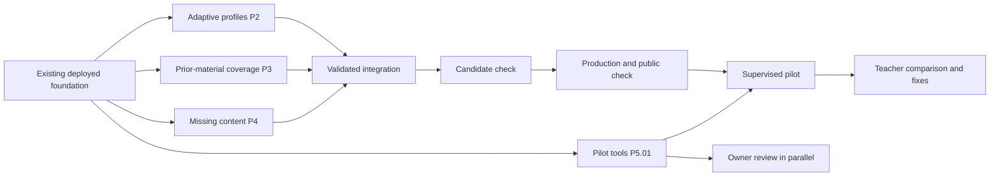

# Atomic French diagnostic and pilot roadmap

Updated: 2026-09-13. Coordinator maintains this file from the JSON ledger; agents update their own workstream reports.

**Execution:** three GPT‑5.6 Sol agents, High reasoning. The coordinator integrates and releases validated changes. The objective still covers all five priorities and all 544 approved targets.

## Order and parallel work

1. The already deployed result/review fixes form the starting point.
2. Run adaptive testing (P2), material-history implementation (P3), and missing content (P4) in parallel. Prepare pilot observation tools (P5.01) alongside them.
3. Within each lane, finish the dependencies shown below before dependent work. Questions and lessons for one content target may be authored in parallel, but their joint validation must finish before publication.
4. Integrate one validated release at a time: inspect the diff → run relevant and integration checks → freeze the matching code/content → verify candidate → promote → verify public behavior → record the deployment.
5. Owner review can run alongside publication and student use. Real-student observation requires actual students; automated profiles do not satisfy that task. A supervised pilot can start within a verified supported scope before all 184 remaining targets are released.

## Status rules

`planned → assigned → in_progress → implemented → validated → production`. A passing local test is not a production release. Human review and student observation remain explicitly pending until real evidence exists. Failed checks return a task to implementation; source and deployment evidence stay attached.

## Atomic integration tasks

| ID | Goal | Depends on | Owner | Status |
|---|---|---|---|---|
| P1.01 | Display per-skill successes separately from mastery | None | coordinator | production |
| P1.02 | Preserve answer review and correction history | None | coordinator | production |
| P1.03 | Save guided repair separately from independent mastery | P1.01 | coordinator | production |
| P1.04 | Explain assessed, untested and unsupported targets | P1.01 | coordinator | production |
| P1.05 | Trace a result to its supporting answers | P1.02 | coordinator | planned |
| P1.06 | Audit evidence from every guided learning flow | P1.03 | coordinator | planned |
| P2.01 | Inventory existing granular profile tests | None | adaptive | validated |
| P2.02 | Implement reproducible profile trace runner | P2.01 | adaptive | validated |
| P2.03 | Verify verb-family and individual-verb contrasts | P2.02 | adaptive | in_progress |
| P2.04 | Verify tense and agreement contrasts | P2.02 | adaptive | in_progress |
| P2.05 | Verify grammar-construction contrasts | P2.02 | adaptive | in_progress |
| P2.06 | Verify spelling contrasts | P2.02 | adaptive | in_progress |
| P2.07 | Verify short-reading contrasts | P2.02 | adaptive | in_progress |
| P2.08 | Verify guessing, skipping and contradictory responses | P2.02 | adaptive | in_progress |
| P2.09 | Verify learning-driven refinement | P2.02, P1.03, P2.12 | adaptive | in_progress |
| P2.10 | Run contrasting complete deployed journeys | P2.03, P2.04, P2.05, P2.06, P2.07, P2.08, P2.09, P2.11 | coordinator | in_progress |
| P3.01 | Reconcile current delivery gaps against route inventory | None | material | validated |
| P3.02 | Complete capture of practice-player material | P3.01 | material | production |
| P3.03 | Complete capture of production-player material | P3.01 | material | implemented |
| P3.04 | Complete capture of reading and feedback material | P3.01 | material | validated |
| P3.05 | Complete capture of dictation material | P3.01 | material | planned |
| P3.06 | Complete capture of legacy diagnostic and demonstration material | P3.01 | material | planned |
| P3.07 | Complete client-version and offline accounting | P3.01 | material | planned |
| P3.08 | Validate and release atomic covered delivery | P3.02, P3.03, P3.04, P3.05, P3.06, P3.07 | coordinator | planned |
| P3.09 | Verify a fresh covered student baseline | P3.08 | coordinator | planned |
| P3.10 | Activate complete-history contract | P3.09 | coordinator | planned |
| P4.01 | Inventory all remaining graph targets | None | coverage | validated |
| P4.02 | Implement the first missing target family | P4.01 | coverage | in_progress |
| P4.03 | Validate each content batch before release | P4.01, P2.02 | coverage | planned |
| P4.04 | Publish verified content batches | P4.03 | coordinator | planned |
| P4.05 | Verify complete 544-target coverage | P4.04 | coordinator | planned |
| P5.01 | Prepare teacher review and observation record | None | coordinator | validated |
| P5.02 | Define and verify the supervised pilot scope | P1.04, P2.02 | coordinator | planned |
| P5.03 | Prepare student pilot access and recovery | P5.02 | coordinator | planned |
| P5.04 | Collect owner content review in parallel | P5.01 | user | awaiting_real_review |
| P5.05 | Observe real students and compare teacher judgments | P5.03, P5.01 | user + coordinator | awaiting_real_students |
| P5.06 | Fix and recheck pilot findings | P5.05 | coordinator | planned |
| P2.11 | Verify next activities using the published full mixed profile | P2.02 | adaptive | validated |
| P2.12 | Verify candidate-to-published follow-up check lifecycle | P4.03 | adaptive + coordinator | validated |

## Acceptance criteria

- **P1.01** — Saved eligible counts match the result and progress views; no mastery-state mutation. Evidence: skill-evidence-rollout-2026-09-13.json.
- **P1.02** — Saved diagnostic answers and wrong-answer filter survive reload. Evidence: revision-41-fresh-recommended-journey-2026-09-12.json.
- **P1.03** — Lost successful response retries exactly once, without changing diagnostic or skill estimates. Evidence: guided-repair-completion-rollout-2026-09-13.json.
- **P1.04** — Every state/mode has student-readable wording; unsupported targets are not shown as weaknesses. Evidence: result-language-audit-2026-09-13.md, atomic-roadmap-rollout-2026-09-13.json.
- **P1.05** — A teacher can identify which independent answers support one specific skill, including later checks.
- **P1.06** — Check legacy practice, guided lessons and repair separately; record actual evidence expectations and fix any assisted response that can falsely confirm independent mastery.
- **P2.01** — Map tests to explicit distinctions and identify missing contrasts. Evidence: workstreams/adaptive.md, revision-41-aller-tense-trace-2026-09-13.json.
- **P2.02** — Fixed inputs reproduce target, mode, difficulty, time, evidence and next-activity traces. Evidence: workstreams/adaptive.md, revision-41-aller-tense-trace-2026-09-13.json.
- **P2.03** — Both known and weak sides are exercised independently; unresolved targets cannot pass by omission; failures become fixes. Evidence: revision-41-etre-avoir-trace-2026-09-13.json.
- **P2.04** — Both known and weak sides are exercised independently; unresolved targets cannot pass by omission; failures become fixes. Evidence: revision-41-aller-tense-trace-2026-09-13.json.
- **P2.05** — Both known and weak sides are exercised independently; unresolved targets cannot pass by omission; failures become fixes. Evidence: revision-41-grammar-construction-trace-2026-09-13.json, workstreams/adaptive.md.
- **P2.06** — Both known and weak sides are exercised independently; unresolved targets cannot pass by omission; failures become fixes. Evidence: revision-41-spelling-trace-2026-09-13.json, workstreams/adaptive.md.
- **P2.07** — Both known and weak sides are exercised independently; unresolved targets cannot pass by omission; failures become fixes. Evidence: revision-41-short-reading-trace-2026-09-13.json, workstreams/adaptive.md.
- **P2.08** — Both known and weak sides are exercised independently; unresolved targets cannot pass by omission; failures become fixes.
- **P2.09** — Guided success alone cannot confirm mastery; independent post-lesson evidence can refine the exact target. Evidence: published-r41-learning-refinement-trace-2026-09-13.json.
- **P2.10** — Fresh profiles finish in 30–40 active minutes, resume correctly, retain separate skill signals and receive suitable activities. Evidence: published-r41-mixed-profile-trace-2026-09-13.json.
- **P3.01** — Each remaining student route/version has a concrete missing-material list. Evidence: workstreams/material.md.
- **P3.02** — Record exact visible and pre-delivered material before exposure; rendering and failure tests cover the route. Evidence: atomic-roadmap-rollout-2026-09-13.json, workstreams/material.md.
- **P3.03** — Record exact visible and pre-delivered material before exposure; rendering and failure tests cover the route. Evidence: workstreams/material.md.
- **P3.04** — Record exact visible and pre-delivered material before exposure; rendering and failure tests cover the route. Evidence: workstreams/material.md: 25 tests across six files, TypeScript and focused lint; live display verification remains pending..
- **P3.05** — Record exact visible and pre-delivered material before exposure; rendering and failure tests cover the route.
- **P3.06** — Record exact visible and pre-delivered material before exposure; rendering and failure tests cover the route.
- **P3.07** — Old clients, account switches, offline packs and errors cannot silently establish complete history.
- **P3.08** — Native database concurrency/rollback checks and deployed route evidence pass; apply only verified migration.
- **P3.09** — Known versus unseen words/sentences have source receipts; interrupted deliveries fail closed; historical students remain incomplete.
- **P3.10** — Enable only supported versions/routes, then verify fresh independent evidence and rollback behavior.
- **P4.01** — Exactly 184 unsupported approved target IDs have requirements, dependencies and individually tracked work. Evidence: workstreams/coverage.md.
- **P4.02** — Questions, lessons and independent checks satisfy the approved target contracts; preserve owner review status.
- **P4.03** — Bundle checksums, target bindings, difficulty range and teaching/question separation pass.
- **P4.04** — Immutable bank and application deploy together; new target is exercised publicly; coverage registry updates.
- **P4.05** — Every target has released questions, independent checks and a usable pathway; no placeholders counted as coverage.
- **P5.01** — Teacher can record target-level agreement, disagreement, confusing wording and inappropriate activities. Evidence: pilot-observation-template-2026-09-13.md.
- **P5.02** — State supported targets, provisional evidence limits, data persistence and support workflow; scope is explicit.
- **P5.03** — Dedicated accounts enter the correct stage, can resume and open lessons without affecting the demo.
- **P5.04** — Actual owner decisions recorded with content version and comments; never substitute automated review.
- **P5.05** — Document actual use, timing, skill-level disagreements and recommended-lesson suitability.
- **P5.06** — Each discrepancy has a reproducible case, validated resolution and deployed version.
- **P2.11** — Use the runtime-validated published bundle. The full35-minute profile receives deliverable next activities while untested skills remain unknown. Evidence: published-r41-mixed-profile-trace-2026-09-13.json.
- **P2.12** — Source candidate drafts remain drafts; actual published release has published pool-valid independent checks with truthful parallel-review provenance. Evidence: published-r41-learning-refinement-trace-2026-09-13.json.

## Remaining content: 184 individually tracked targets

Each approved target has five atomic records: **Q** assessment question pool, **L** guided lesson, **V** binding/separation validation, **R** verified production publication, and **O** actual owner review. Q and L can run in parallel; V requires both; R requires V; O can run alongside release after Q/L exist. Shared content may satisfy several targets only when each target’s own requirements pass.

The registry contains 184 targets and 920 target-level tasks. Status counts: awaiting_real_review: 184, implemented: 10, planned: 726.

[Exact target IDs, labels, evidence requirements and task dependencies](remaining-target-goals-2026-09-13.json).

## Current findings

- **P3.02** (2026-09-13): Third-help answer save fixed in399a674. Candidate and public checks saved exactly one wrong answer; public record confirms hintsUsed=3 and exact feedback capture.
- **P4.02** (2026-09-13): 64 draft questions and5 lessons across5 targets prepared; cause family is next provisional release candidate. Drafts are not production coverage.
- **P2.10** (2026-09-13): CORRECTION: the no-activity result used a pre-publication candidate with draft bindings. Runtime-validated publishedR41 returns5 independent checks and0 missing bindings. Its unchanged61-question/2100-second simulation samples25/360 skills, leaves335 untested and8/12 declared profile contrasts unmet. No runtime publication/planner fix is justified by the candidate-stage result.
- **P2.10** (2026-09-13): Published R41 full-budget all-wrong counterpart: 61 incorrect responses, 15 provisional direct gaps, 332 unknown targets and five published prerequisite-free lessons; zero official resolutions. Declared targets not reached remain explicit. This is a runtime-bundle simulation, not live student calibration.

## Workstream reports

- [Adaptive assessment](workstreams/adaptive.md)
- [Prior-material recording](workstreams/material.md)
- [Content coverage](workstreams/coverage.md)

## Release log

- `dpl_H5Y1JqcrviYMhQP9kzNw4a6H5gKU` · `773d3f7` · production_verified: Existing baseline: 360/544 targets; results and progress counts verified on 19 eligible skills. Evidence: skill-evidence-rollout-2026-09-13.json.
- `dpl_5Dsg1ZzaYkieT7Kaper26svvvJny` · `399a674` · production_verified: Lesson-routing correction, exact practice display/feedback capture, and third-help save correction; scope remains360/544. Evidence: atomic-roadmap-rollout-2026-09-13.json.
- New agent work is not deployed until an explicit validated release entry is added.

No completion date is invented. Scope coverage, acceptance evidence and actual releases determine progress.
