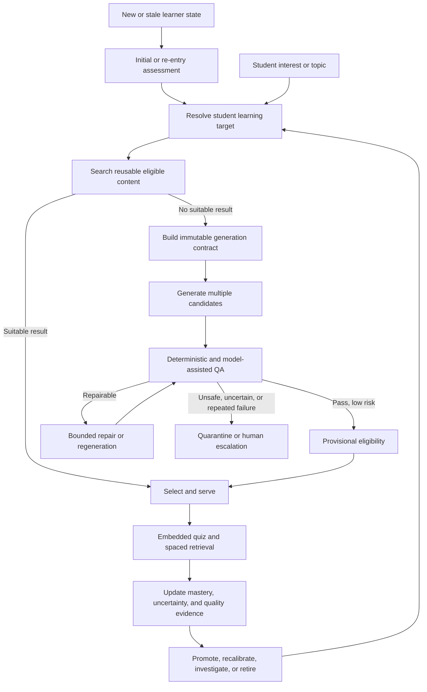
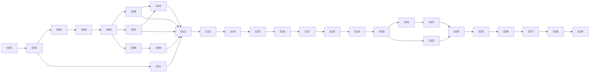

# French learning graph and automated content roadmap

**Status:** Implementation in progress (G01 verified)  
**Product:** SigmaWrite  
**Scope:** French L1, French L2/FSL, heritage, bilingual, allophone, and immersion learners  
**Primary outcome:** Safe, adaptive, on-demand French reading content without requiring manual review of every passage or question

## 1. Executive decision

SigmaWrite will not ask a generative model to reinvent pedagogy for every student request.

The system will maintain a stable, versioned French learning foundation that defines:

- what students can learn;
- prerequisite relationships between competencies;
- vocabulary and linguistic constructions appropriate at each level;
- the distinction between French L1 progression and French L2/FSL progression;
- observable evidence of mastery;
- how verb tenses and conjugation progress from recognition to controlled and independent use;
- what a specific student has mastered, is learning, or is ready to learn next.

The student may choose an interest or topic. SigmaWrite will combine that interest with the stable learning foundation and the student's current state to produce a **generation contract**. The model may be imaginative about the topic, examples, tone, and narrative treatment, but it may not freely choose the instructional level, vocabulary envelope, grammatical demand, target competencies, verb-tense profile, or question design.

The production model is therefore:

> **Deterministic instructional envelope; generative content inside that envelope.**

Every generated candidate will pass automated quality gates. Low-risk, high-confidence content may be served provisionally without prior human approval. Human reviewers will calibrate the system, audit samples, review high-risk or anomalous content, resolve automated disagreements, and maintain benchmark suites. They will not review every generated passage.

The graph remains fine-grained internally, but students and families will not experience learning as an endless collection of disconnected nodes. SigmaWrite will package micro-learnings into versioned lessons, modules, and courses with understandable goals and meaningful completion states. These groupings are intentionally curated product structures rather than claims that there is only one objectively correct way to divide French. A student should be able to say, for example, “I completed the course on narrating in the past,” while spaced retrieval continues to protect that learning after completion.

## 2. Why the previous review model cannot be the production model

Student interests and topics are effectively unbounded. Requiring three human reviews for every passage and every question would create a permanent publication bottleneck, make on-demand generation impossible, and concentrate human effort on routine content instead of failures and system calibration.

The Human Content Review Portal remains valuable, but its long-term purpose changes:

- **initially:** review the first 60 passages and establish human ground truth;
- **continuously:** audit random samples and new model or prompt versions;
- **selectively:** review high-risk topics, automated disagreements, user reports, and performance anomalies;
- **strategically:** maintain gold and silver regression benchmarks;
- **editorially:** investigate, revise, retire, and document exceptional content.

The initial 60 passages are a calibration corpus, not the template for reviewing all future production content.

## 3. Product principles

### 3.1 Pedagogy is predefined; topical expression is generative

The model chooses how to explain or narrate a topic. SigmaWrite chooses what the student is ready to encounter and practise.

### 3.2 Reuse before generation

Before generating a new passage, the system searches for an existing passage that matches the student's topic, level, target competencies, vocabulary needs, and recent reading history. Generation occurs only when reuse would be repetitive, pedagogically unsuitable, or unavailable.

### 3.3 One French graph with multiple progression overlays

SigmaWrite will not duplicate universal French competencies into separate L1 and L2 graphs. A shared node may have different mappings, prerequisite emphasis, evidence requirements, or expected ages across:

- French first language;
- French second language/FSL;
- heritage French;
- bilingual education;
- allophone support;
- French immersion.

Native-grade, CEFR, DELF/DALF, immersion, and other curriculum mappings are overlays on shared competencies.

### 3.4 Mastery and percentile are different

A percentile compares a student with a reference group. Mastery estimates whether the student can reliably perform a specific competency. Both can inform reporting, but instructional targeting must be driven primarily by competency mastery, uncertainty, prerequisite readiness, and recent evidence.

### 3.5 Difficulty is multidimensional

Reading difficulty cannot be reduced to word count or sentence length. The system must consider at least:

- lexical demand;
- syntax and grammar;
- conjugation and temporal organisation;
- background knowledge;
- inference demand;
- cohesion and discourse structure;
- text type;
- reading endurance;
- question demand.

### 3.6 Conjugation is first-class

Verb tenses are not merely metadata or isolated drills. They shape comprehension, chronology, viewpoint, narration, argumentation, and written production. The graph, generation contract, passage QA, question QA, and student model must all represent conjugation explicitly.

### 3.7 Automated acceptance is confidence- and risk-based

Not every text receives the same treatment. Fictional, low-risk passages with strong validation may pass automatically. Passages involving medical advice, politics, current events, disputed history, sensitive identities, named living people, or numerical claims require stricter grounding or escalation.

### 3.8 Production usage provides evidence, not unquestioned truth

Student responses, abandonment, latency, distractor selection, summaries, and teacher reports can reveal unclear or miscalibrated content. Usage may adjust confidence and trigger investigation, but it must not silently rewrite content, change answer keys, or alter the graph without controlled validation.

### 3.9 All foundations are versioned and auditable

Every generated text must be traceable to:

- taxonomy release;
- vocabulary release;
- student-state snapshot;
- generation-contract version;
- prompt version;
- model and provider;
- QA-gate versions and results;
- source material when factual grounding is used.

### 3.10 Students need finite, nameable achievements

Atomic nodes make adaptation and diagnosis possible, but they do not by themselves create a satisfying learning journey. SigmaWrite must aggregate them into:

```text
micro-learning → lesson → module → course
```

The same micro-learning may appear in several courses, and a course may be reorganized in a later version without changing the underlying competency identity. Course completion is a durable achievement event. It means that the learner completed the required pathway and demonstrated the defined completion evidence; it does not mean the learner can never forget the material or no longer needs review.

### 3.11 Memory is maintained through direct and indirect spaced repetition

SigmaWrite will revisit learning in two complementary ways:

- **direct retrieval:** scheduled vocabulary, conjugation, grammar, comprehension, and concept prompts;
- **indirect retrieval:** previously learned words, constructions, verb tenses, and competencies deliberately reappear inside future passages and questions.

The scheduler must interleave review with new learning, update intervals from retrieval evidence, and continue after a lesson or course is completed. Completion and durable mastery are related but separate states.

### 3.12 The default challenge zone targets approximately 80% success

The adaptive engine should normally choose work for which the student has about an **80% predicted probability of success**, using a practical operating band such as 75–85%. This is the productive difficulty zone: demanding enough to create learning, but not so difficult that repeated failure damages comprehension or motivation.

This 80% target is:

- not the student's percentile;
- not a requirement that every session end with exactly 80% correct;
- not the mastery threshold for declaring a competency learned;
- not a reason to manipulate or discard genuine evidence.

Some tasks should intentionally differ: fluency and confidence work may target higher success; diagnostic probes and bounded stretch tasks may target lower success. The scheduler must explain these exceptions and return to the normal zone rather than allowing uncontrolled difficulty drift.

### 3.13 Assessment is granular, multidimensional, and continuous

Every new student must complete an adaptive entry assessment. A returning student must complete a targeted re-entry assessment when prior evidence has become stale after a configurable period of inactivity or when uncertainty has materially increased.

The result is not one harmonised “French level.” It is a jagged mastery profile across detailed nodes, strands, modalities, and receptive/productive dimensions. A student may be advanced in reading comprehension, average in vocabulary, weak in spelling, and missing specific conjugation prerequisites. The system must preserve those differences rather than averaging them away.

Assessment has two responsibilities:

1. identify the deepest missing foundations and construct prerequisite-aware repair paths;
2. estimate current mastery and uncertainty precisely enough to place subsequent work in the productive difficulty zone.

Assessment continues during normal use through short, low-stakes quizzes and unobtrusive calibration probes. These reinforce retrieval while updating mastery estimates. A wrong answer is evidence about one or more nodes and possible misconceptions; it is not simply a course score.

## 4. Target system model

SigmaWrite needs four connected shared layers plus a per-student overlay and a content-evidence layer.

### 4.1 Competency graph: what a learner can do

Examples:

- identify explicit information;
- determine the main idea;
- resolve a pronoun reference;
- recognise cause and consequence;
- make a local inference;
- compare viewpoints;
- summarise a paragraph;
- justify an interpretation with textual evidence;
- distinguish fact, opinion, and argument.

Each atomic competency needs:

- stable key and version;
- strand and domain;
- type: conceptual, procedural, linguistic, representational, or metacognitive;
- French label and precise description;
- L1 and L2 mappings;
- observable mastery evidence;
- allowed assessment modalities;
- positive and negative examples;
- prerequisites and the reason for each relationship;
- provenance and review status.

### 4.2 French lexical graph: which words and senses are available

The lexical layer must operate at the level of lemmas, senses, forms, and relationships rather than treating every surface form as an unrelated word.

Candidate fields include:

- lemma and distinct senses;
- part of speech;
- grammatical gender where applicable;
- inflected forms;
- word family and derivational morphology;
- frequency and source corpus;
- L1 grade range;
- L2/CEFR recognition and production ranges;
- register and domain;
- collocations;
- synonyms, antonyms, and simpler substitutions;
- polysemy and ambiguity risk;
- cognates and false friends by home language;
- whether a word is expected, teachable, specialist, or a proper noun;
- whether mastery is receptive, productive, or both.

Topic-specific vocabulary may exceed the general level when it is deliberately limited, introduced in context, and supported. A passage about *One Piece*, for example, may need words such as *équipage*, *trésor*, *navigation*, or *rival*. Those words should be intentional exceptions, not evidence that the entire lexical envelope can be ignored.

### 4.3 Linguistic-construction and conjugation graph: how French is organised

This layer describes reusable language structures, including:

- sentence types and clause structures;
- coordination and subordination;
- pronoun systems and reference chains;
- negation;
- agreement;
- connectors and discourse relations;
- nominalisation;
- reported speech;
- tense, mood, aspect, and temporal sequencing.

#### Required conjugation dimensions

Conjugation nodes must distinguish:

- recognising a tense from producing it;
- regular formation from irregular forms;
- choosing the correct auxiliary;
- past-participle agreement;
- form from meaning and discourse use;
- isolated sentences from connected text;
- temporal reference from aspectual contrast;
- oral, reading, and written mastery.

The initial progression should cover, with explicit prerequisites and L1/L2 mappings:

- présent de l'indicatif;
- futur proche;
- passé récent;
- passé composé;
- imparfait;
- contrast between passé composé and imparfait;
- passé simple, at least as a receptive literary tense before any productive expectation;
- futur simple;
- plus-que-parfait;
- conditionnel présent;
- subjonctif présent at an appropriate later stage;
- imperative and common non-finite forms;
- tense agreement and temporal sequencing in connected discourse.

Later releases should extend this foundation to advanced compound and literary forms, including futur antérieur, conditionnel passé, subjonctif passé, and passé antérieur, with sharply differentiated L1-reading, L1-writing, and L2 expectations.

The graph must also represent high-value families and dependencies: person and number, subject recognition, verb groups, auxiliaries, participles, agreement, irregular high-frequency verbs, temporal markers, and narrative structure.

#### Conjugation in generated student content

Every generation contract must specify:

- **allowed tenses:** safe for independent comprehension;
- **target tenses:** deliberately practised or reinforced;
- **stretch tenses:** limited and context-supported;
- **excluded tenses or constructions:** outside the current learning zone;
- expected temporal connectors;
- acceptable density of tense switching;
- whether questions assess form, meaning, chronology, or discourse effect.

Generated texts should not be mechanically restricted to one tense. They should use a controlled tense profile appropriate to the text type and student state. For example, a learner who has mastered the present and passé composé but is developing the imparfait may receive a short narrative that uses the passé composé for events and a limited number of clearly supported imparfait forms for setting and habitual background.

### 4.4 Content-concept graph: what the passage assumes about the world

This layer represents background concepts and topic relationships, not French competencies. It helps the system determine what must be explained rather than assumed.

Example:

```text
One Piece
├── manga
├── fictional world
├── pirate crew
├── voyage
├── treasure
├── friendship
└── narrative conflict
```

Concept nodes should include familiarity estimates, risk classification, source requirements, and links to simpler prerequisite concepts. The concept graph prevents a linguistically simple passage from becoming difficult because it assumes unexplained background knowledge.

### 4.5 Student mastery overlay

The shared graphs are stable; the student overlay changes continuously. It should track:

- mastery probability and uncertainty per competency;
- last reliable diagnostic or calibration evidence per strand and node;
- receptive and productive mastery;
- written, oral, listening, and reading evidence;
- vocabulary recognition and retrieval state;
- fluency, accuracy, and response latency;
- misconceptions;
- prerequisite gaps;
- recent exposure and forgetting;
- due retrieval and the stability of recalled knowledge;
- predicted success at candidate difficulty levels;
- interests and engagement signals;
- current learning goal and framework;
- lesson, module, and course progress;
- identified foundation gaps and active remediation paths;
- accommodations.

### 4.6 Content and evidence layer

Every passage, paragraph, question, distractor, vocabulary target, and retrieval card links back to the competencies, lexical items, constructions, verb tenses, and concepts it exercises or assumes. Student interactions then become evidence against those links.

### 4.7 Learning-package layer: lessons, modules, and courses

The knowledge graph describes learning at the level required for diagnosis. A separate packaging layer organizes those nodes into experiences that students, parents, and teachers can understand and complete.

- A **micro-learning** is one atomic competency or a very small evidence-bearing practice objective.
- A **lesson** is a short coherent sequence with one visible purpose, typically combining explanation, guided practice, reading or listening context, retrieval, and a completion check.
- A **module** groups related lessons into a broader capability.
- A **course** is a finite, named pathway with an audience, progression overlay, required and optional modules, completion criteria, and version.

Examples:

```text
Course: Raconter au passé — foundations
├── Module: Repérer le temps d'un récit
│   ├── Lesson: Temporal markers
│   └── Lesson: Recognising passé composé and imparfait
├── Module: Events and background
│   ├── Lesson: Passé composé for bounded events
│   ├── Lesson: Imparfait for setting and habits
│   └── Lesson: Choosing between the two in context
└── Module: Build a coherent short narrative
```

Packaging rules:

- membership is many-to-many: the same node can support several lessons or courses;
- required, optional, remedial, and enrichment elements are explicit;
- course structure is versioned independently from the competency graph;
- course completion records the exact course version;
- completion criteria may combine required lesson completion, evidence coverage, and a final application task;
- a completed course remains completed even if later forgetting schedules new retrieval;
- later review can restore mastery without erasing the student's achievement;
- parent and student reporting uses human-readable course and module names, while adaptive decisions continue to use micro-level evidence.

### 4.8 Graph-aware spaced repetition and difficulty targeting

The scheduler combines three queues:

1. **due memory:** vocabulary, verb forms and uses, constructions, competencies, or concepts whose retrieval is due;
2. **ready-to-learn frontier:** new targets whose hard prerequisites are sufficiently mastered;
3. **course commitments:** required work needed to make visible progress in the active lesson, module, or course.

It then selects a balanced session whose predicted success is normally near 80%. Prediction should use student mastery, uncertainty, item and passage difficulty, modality, response type, latency, and recent evidence. New material should not crowd out overdue retrieval, and retrieval should not make the course feel directionless.

Spaced repetition must support:

- item-level schedules when an exact prompt is worth repeating;
- node-level schedules that allow a different prompt to test the same learning;
- vocabulary and conjugation schedules that distinguish recognition from production;
- indirect scheduling that requests prior learning inside a new generation contract;
- interleaving across related competencies rather than blocked repetition only;
- lapse handling and prerequisite repair;
- minimum spacing and anti-overexposure rules;
- an auditable explanation of why each review appeared.

The scheduler should treat 80% as a target probability distribution, not as a retrospective score quota. It may deliberately select an easier retrieval item and a harder stretch item in the same session while keeping the overall expected experience in the productive zone.

### 4.9 Adaptive assessment, re-entry, and continuous recalibration

The assessment engine traverses the graph rather than administering one fixed grade-level test. It starts with broad probes, follows evidence upstream or downstream, and stops exploring a branch when the system has sufficient confidence or when the next question would add little information.

The assessment must produce separate estimates for areas such as:

- orthographe lexicale;
- orthographe grammaticale;
- grammaire and syntaxe;
- conjugaison, including form and tense use;
- lexique;
- compréhension écrite;
- inference, structure, summary, and analysis;
- receptive versus productive performance;
- oral, written, listening, and reading modalities where relevant to the student's goal.

#### Initial assessment

For a new student, the engine should:

- begin from age, schooling, learner mode, declared language history, and goal without treating these as proof of mastery;
- sample across major strands;
- drill into suspected gaps at the prerequisite level;
- avoid asking every node directly;
- record uncertainty and untested regions;
- produce a recommended starting course plus targeted remediation lessons;
- explain the profile in plain language without reducing it to one score.

#### Re-entry assessment

For a student returning after a long absence, the engine should:

- preserve historical attempts, course completions, and previous mastery evidence;
- apply configured forgetting and staleness rules;
- retest a strategic sample of previously stable, fragile, and prerequisite-critical nodes;
- expand only where the sample reveals decay or prior uncertainty;
- refresh the active repair path and difficulty estimate;
- avoid forcing a full first-time assessment when targeted recalibration is sufficient.

The inactivity threshold should be configurable and later calibrated from data. Time alone should not erase mastery; it should increase uncertainty and trigger evidence collection.

#### Continuous quizzes during courses and normal use

Regular quizzes should be short, low-stakes, and distributed rather than saved only for the end of a course. They serve three distinct purposes:

- **retrieval quizzes:** reinforce learning whose review is due;
- **course checkpoints:** verify that required lesson outcomes can be applied;
- **calibration probes:** test uncertain or potentially stale estimates with high-information items.

A quiz may mix these purposes, but every item must record its purpose and node links. Results update mastery probability, uncertainty, misconceptions, retrieval scheduling, and predicted difficulty. The system should vary prompts and contexts so that success reflects transferable learning rather than memorisation of one answer.

#### Remediation response

When assessment or quizzes expose a missing foundation, the system should:

1. trace the unmet prerequisite path;
2. distinguish an isolated lapse from a persistent gap;
3. select or generate the smallest suitable remediation lesson;
4. temporarily adjust downstream course sequencing without deleting progress;
5. reassess after instruction and retrieval;
6. return the student to the main pathway when the prerequisite is sufficiently stable.

## 5. The generation contract

A generation contract is the deterministic interface between the learning system and the generative model. It is created before generation and saved immutably with the result.

### 5.1 Inputs

- student learning profile and goal;
- mastery estimates and uncertainty;
- initial, re-entry, and continuous-calibration evidence;
- active foundation gaps and remediation path;
- ready-to-learn frontier;
- vocabulary known, learning, and due for retrieval;
- competencies, constructions, verb tenses, and concepts due for direct or indirect retrieval;
- permitted linguistic constructions and verb tenses;
- target competencies;
- active lesson, module, and course context;
- interest or topic;
- requested or selected text type;
- target length and endurance demand;
- concept familiarity and factual-risk level;
- recent content history to avoid repetition.

### 5.2 Contract outputs

- target difficulty range, not a single false-precision number;
- predicted success centered on the configured productive zone, normally about 80%;
- expected lexical coverage and maximum unfamiliar-word budget;
- required vocabulary targets and contextual support;
- required spaced-retrieval inclusions and their presentation mode;
- permitted and target grammatical constructions;
- explicit conjugation profile;
- target reading competencies;
- permitted question types and difficulty;
- concept prerequisites and explanations required;
- factual grounding requirements;
- safety rules;
- retry and escalation policy.

### 5.3 Example: interest in *One Piece*

```yaml
learner_mode: french_second_language
current_level: upper_A2
target_zone: early_B1
predicted_success_target: 0.80
topic: One Piece and the role of a crew
text_type: explanatory
length_words: 380-430
course_context: Raconter au passé — foundations
target_competencies:
  - identify_cause_and_consequence
  - infer_character_motivation
known_vocabulary_coverage_min: 0.94
new_target_words:
  - équipage
  - rival
  - naviguer
allowed_tenses:
  - present_indicative
  - passe_compose
target_tenses:
  - imparfait_background_use
retrieval_targets:
  - passe_compose_bounded_event
  - causal_connector_parce_que
stretch_tense_occurrences_max: 4
excluded_constructions:
  - literary_past
  - complex_subjunctive
questions:
  literal: 1
  vocabulary_in_context: 1
  causal_inference: 2
  tense_meaning: 1
factuality_mode: low_risk_fandom_overview
```

The model is free to create an engaging angle and examples but must remain inside this contract.

## 6. Automated content lifecycle



### 6.1 Automated QA gates

#### Gate A: structure and schema

- valid passage and paragraph structure;
- requested length and question count;
- valid choices and answer keys;
- no formatting artefacts;
- complete provenance and generation metadata.

#### Gate B: lexical compliance

- expected known-word coverage;
- unfamiliar-word budget;
- target words present and context-supported;
- appropriate register;
- specialist terms intentional;
- no unexplained lexical jumps.

#### Gate C: grammar, syntax, and conjugation

- permitted constructions only;
- target constructions present at controlled density;
- verb forms grammatically correct;
- tense distribution matches the contract;
- tense changes are coherent and signalled;
- agreement and reference chains are valid;
- text type uses an appropriate temporal profile.

#### Gate D: difficulty and instructional alignment

- multidimensional difficulty within target range;
- predicted student success within the configured zone, normally 75–85% and centered near 80%;
- target competency genuinely exercised;
- prerequisite knowledge not exceeded;
- due indirect-retrieval targets present without overwhelming the new objective;
- active lesson or course purpose respected;
- stretch demand bounded;
- reading endurance appropriate.

#### Gate E: question verification

- answer supported by the passage;
- exactly one defensible answer for closed questions;
- distractors plausible but incorrect;
- explanation agrees with the answer;
- question tests the declared competency;
- question does not require external topic knowledge;
- tense questions test meaningful interpretation or controlled form as declared.

#### Gate F: safety, cultural appropriateness, and prompt defence

- age-appropriate content;
- no hidden prompt injection from a student topic;
- no unsafe or manipulative instructions;
- controlled treatment of sensitive identities and events;
- copyright-aware generation rules;
- no unnecessary personal data.

#### Gate G: factuality and risk

- claims catalogued;
- numerical and time-sensitive claims grounded;
- trusted sources required for medium- and high-risk topics;
- unresolved factual disagreement escalated;
- fiction clearly treated as fiction.

#### Gate H: duplicate and quality ranking

- avoid near-duplicates and repetitive templates;
- compare multiple candidates;
- rank naturalness, engagement, contract compliance, and question quality;
- retain QA results for rejected candidates without serving them.

### 6.2 Serving states

```text
generated
→ automated_qc
→ eligible_provisional
→ empirically_validated
→ trusted_reusable
```

At any point, content may move to:

```text
repair_required | quarantined | human_review | retired
```

No automated result is published merely because model generation completed.

## 7. Learning from production usage

The system should monitor at least:

- completion and abandonment;
- reading time and unusual latency;
- answer accuracy by student ability;
- distractor selection by mastery profile;
- question discrimination;
- summary quality;
- mismatch between predicted and observed difficulty;
- teacher and student reports;
- vocabulary retention after later retrieval;
- performance on target verb tenses and constructions;
- transfer from isolated conjugation practice to comprehension and writing.
- stability of learning after lesson and course completion;
- whether predicted success was calibrated around the 80% target zone;
- whether direct and indirect retrieval improve later unaided performance.

Examples of automatic investigation triggers:

- high-performing students disproportionately choose the same declared-wrong answer;
- almost every student answers a supposedly discriminating question correctly;
- a passage has abnormal abandonment after one paragraph;
- a target word is consistently misunderstood despite contextual support;
- students conjugate a form correctly in isolation but misinterpret its temporal value in text;
- a prerequisite edge does not predict later success after sufficient evidence.

Usage evidence may change confidence, eligibility, or recalibrated difficulty within bounded limits. It may not destructively alter the reviewed content version or taxonomy release.

## 8. Sparse human review policy

Human review is required for:

- initial calibration corpus;
- random audit sample;
- high-risk subject matter;
- unresolved factual claims;
- automated evaluator disagreement;
- repeated generation or repair failure;
- student-performance anomalies;
- teacher or student reports;
- new model, prompt, taxonomy, or QA versions;
- new competency families, especially before automated acceptance is enabled;
- benchmark creation and governance.

The initial sampling policy should be conservative and become evidence-based. A starting policy could audit all new pipeline versions, all high-risk content, and a random 2–5% of otherwise automatically accepted content. The percentage is a configurable operating parameter, not a permanent product rule.

## 9. Lessons from `withmarbleapp/os-taxonomy`

The Marble repository is valuable as a model for taxonomy authoring and governance, not as French curriculum content to import directly.

Useful patterns:

- fine-grained topics with stable identifiers;
- observable mastery-evidence statements;
- assessment prompts;
- explicit prerequisite edges with hard/soft strength and reasons;
- many-to-many curriculum-standard mappings;
- parent-friendly domain clusters;
- JSON schemas and referential-integrity validation;
- manifests, checksums, versioning, provenance, and licensing documentation.

Limitations for SigmaWrite:

- it contains English learning topics, not French;
- its vocabulary nodes describe vocabulary-learning skills, not a word-level lexicon;
- age ranges do not model L1 versus L2 progression;
- it does not contain per-student mastery or production psychometrics;
- some topics are broader than a truly atomic competency;
- adapting its data creates ODbL/CC BY-SA and upstream-source obligations that require legal and provenance review.

Decision:

> Use the repository's modelling discipline and release practices as inspiration. Build an original French taxonomy from verified, appropriately licensed L1 and L2 sources. Do not translate or import the dataset wholesale.

References:

- <https://github.com/withmarbleapp/os-taxonomy>
- <https://github.com/withmarbleapp/os-taxonomy/blob/main/README.md>
- <https://github.com/withmarbleapp/os-taxonomy/blob/main/PROVENANCE.md>

## 10. Current SigmaWrite foundation

SigmaWrite already has important architectural components:

- universal competency nodes with native-grade and CEFR overlays;
- multiple learner modes;
- typed edges for prerequisites, misconceptions, transfer, families, and remediation;
- receptive/productive and oral/written mastery estimates;
- item attempts and misconceptions;
- graph traversal, ready-to-learn frontier, catch-up paths, and cycle checks;
- vocabulary items and per-student word mastery;
- an existing diagnostic and skill-estimate foundation that must evolve into granular graph traversal, re-entry assessment, and continuous recalibration;
- deterministic text-difficulty scoring;
- immutable content versions and audit trails;
- a human-review and benchmark workflow.

The main gap is curricular depth and integration. The migration history contains one explicit human-anchored slice of 30 competency nodes focused on nominal-group agreement and the present tense. The vocabulary model is still closer to a catalog than a complete French lexical graph. The deterministic difficulty engine uses useful surface features but not yet a comprehensive versioned lexical and construction foundation.

Consequently, the roadmap should extend and connect the existing architecture rather than replace it.

## 11. Ordered implementation roadmap

Each goal below is intended to be self-contained enough for one focused implementation session or one small pull request. A goal must not begin until its listed dependencies are complete and accepted.

### Sequence overview

| Order | Goal | Outcome | Why it is sequenced here |
|---:|---|---|---|
| 1 | G01 | Ontology and scope contract | Prevents incompatible schemas and duplicated L1/L2 graphs. |
| 2 | G02 | Source, provenance, and licensing register | Data cannot be imported or authored safely without source rules. |
| 3 | G03 | Versioned taxonomy schema | Creates stable storage before large-scale authoring. |
| 4 | G04 | Taxonomy validator and release manifest | Prevents bad graph data from accumulating. |
| 5 | G05 | L1/L2 progression matrices | Establishes the level framework used by every later slice. |
| 6 | G06 | Conjugation foundation slice | Makes verb tense a first-class dependency early. |
| 7 | G07 | Reading-comprehension foundation slice | Supplies the core reading targets for generated texts and questions. |
| 8 | G08 | Lexical graph schema | Defines the word-level contract before importing vocabulary. |
| 9 | G09 | Baseline French lexicon import | Populates vocabulary constraints with traceable real data. |
| 10 | G10 | Grammar and discourse construction slice | Adds syntax, cohesion, and temporal organisation to difficulty. |
| 11 | G11 | Content-concept and topic model | Separates background knowledge from language difficulty. |
| 12 | G12 | French Taxonomy v1 release | Produces the first coherent, immutable foundation. |
| 13 | G13 | Initial and re-entry graph diagnostic | Produces a granular, non-harmonised mastery profile and repair paths. |
| 14 | G14 | Lesson, module, and course packaging | Creates finite, nameable learning pathways and completion states. |
| 15 | G15 | Graph-aware spaced repetition | Integrates direct and indirect retrieval with course progress. |
| 16 | G16 | Embedded quizzes and recalibration | Reinforces retrieval and continuously updates node-level mastery. |
| 17 | G17 | Student target resolver and 80% zone | Selects ready, due, remedial, and course-relevant work at productive difficulty. |
| 18 | G18 | Generation-contract builder | Creates the deterministic interface to generation. |
| 19 | G19 | Reuse-before-generation matcher | Avoids unnecessary cost, latency, and content proliferation. |
| 20 | G20 | Contract-constrained candidate generation | Generates multiple traceable candidates without serving them. |
| 21 | G21 | Passage QA gates | Verifies language, difficulty, conjugation, structure, and alignment. |
| 22 | G22 | Question QA gates | Prevents ambiguous or unsupported questions from reaching students. |
| 23 | G23 | Safety, factuality, and risk router | Applies differentiated rules before automated acceptance. |
| 24 | G24 | Automated decision and repair orchestrator | Combines QA results into pass, repair, regenerate, or quarantine. |
| 25 | G25 | Provisional serving lifecycle | Enables bounded student exposure without calling content trusted too early. |
| 26 | G26 | Empirical quality and psychometric loop | Learns from usage and detects bad content or graph relationships. |
| 27 | G27 | Sparse human-review operating model | Converts the portal from universal gate to calibration and exception queue. |
| 28 | G28 | Expanded benchmark and release gate | Protects quality when prompts, models, graphs, or QA rules change. |
| 29 | G29 | Staged on-demand-generation rollout | Enables the feature progressively with measurable stop conditions. |

### Phase A — Ontology, governance, and integrity

#### G01 — Approve the French ontology and initial product scope

**Implementation status:** ✅ Implemented and verified on 2026-07-11. See [`french-ontology-v1.md`](./french-ontology-v1.md). Verification: the decision record defines all required boundaries and rules, and its 12-example calibration set covers the acceptance edge cases.

**Outcome:** A single written ontology contract defines the shared graph layers, node types, edge semantics, learner overlays, naming rules, atomicity rules, and initial target range.

**Depends on:** None.

**Why first:** Every later migration, import, graph edge, and generation rule depends on these meanings. Changing them after content population would require costly data repair.

**Deliverables:**

- ontology decision record;
- explicit definition of atomic competency;
- graph-layer boundaries;
- L1/L2/heritage/immersion overlay rules;
- conjugation modelling rules;
- initial age, grade, and CEFR scope;
- non-goals for v1.

**Acceptance criteria:**

- the same competency is not duplicated merely because L1 and L2 progress differently;
- every edge type has one unambiguous direction and meaning;
- reviewers can classify ten representative examples consistently;
- conjugation form, meaning, and discourse use are explicitly separable.

#### G02 — Create the source, provenance, and licensing register

**Implementation status:** ✅ Implemented and verified on 2026-07-11. See [`french-source-register.md`](./french-source-register.md). Verification: every planned source class has an owner, status, allowed fields, attribution rule, import decision, derivative-data policy, and fail-closed intake process; no external lexical dataset is marked importable without recorded commercial terms.

**Outcome:** Every planned curriculum, vocabulary, frequency, morphology, grammar, and assessment source has an owner, usage status, permitted fields, required attribution, and import decision.

**Depends on:** G01.

**Why here:** Licensing and provenance influence schema fields and determine what can be stored, transformed, or redistributed.

**Deliverables:**

- source register;
- license decision per source;
- codes-only versus full-text policy;
- attribution templates;
- prohibited-source list;
- process for adding future sources.

**Acceptance criteria:**

- no source is marked importable without recorded terms;
- every imported record can point to its source and version;
- derivative and generated data obligations are documented.

#### G03 — Extend the database for versioned taxonomy releases

**Implementation status:** ✅ Implemented and verified on 2026-07-11. See migration [`0036_versioned_french_taxonomy.sql`](../supabase/migrations/0036_versioned_french_taxonomy.sql) and its pgTAP test [`0036_versioned_french_taxonomy_test.sql`](../supabase/tests/0036_versioned_french_taxonomy_test.sql). Verification: the additive schema preserves existing node identifiers and estimates, records structured evidence/provenance and independent mappings, snapshots release members, and rejects mutation of published releases.

**Outcome:** The existing graph supports structured evidence, node types, domains/clusters, edge reasons and hard/soft classification, source links, release membership, and immutable published releases.

**Depends on:** G01, G02.

**Why here:** Large-scale graph authoring must target a stable schema, not ad hoc migrations.

**Deliverables:**

- additive migration;
- taxonomy releases and release membership;
- structured mastery evidence;
- curriculum/source mapping tables;
- edge rationale and classification;
- compatibility path for existing nodes and estimates;
- RLS and audit rules.

**Acceptance criteria:**

- current graph functionality continues to work;
- published releases are immutable;
- a node can map independently to native grade and CEFR;
- evidence and provenance are queryable relationally;
- clean database rebuild and database tests pass.

#### G04 — Build the taxonomy validation and release-manifest pipeline

**Implementation status:** ✅ Implemented and verified on 2026-07-11. See [`validate.ts`](../src/lib/taxonomy/validate.ts), the reproducible CLI [`validate-taxonomy.mts`](../scripts/validate-taxonomy.mts), and CI script `taxonomy:validate`. Verification: automated fixtures plant cycles, dangling edges, self-loops, missing provenance, and atomicity warnings; manifests remain identical across reordered input and taxonomy validation is part of `npm run ci`.

**Outcome:** A candidate taxonomy release cannot publish unless structural, referential, semantic, provenance, and checksum validation succeeds.

**Depends on:** G03.

**Why here:** Validation must exist before the graph becomes large enough for manual checking to fail.

**Deliverables:**

- schema validation;
- dangling-edge and self-loop checks;
- duplicate detection;
- cycle detection;
- grade/CEFR monotonicity warnings;
- missing evidence and provenance checks;
- atomicity warnings;
- manifest counts and checksums;
- reproducible export.

**Acceptance criteria:**

- planted cycles and dangling references fail deterministically;
- warnings do not silently disappear;
- the same release produces the same manifest and checksums;
- CI validates every taxonomy change.

### Phase B — French foundation content

#### G05 — Define L1 and L2 progression matrices

**Implementation status:** ✅ Implemented and verified on 2026-07-11. See [`french-progression-matrices-v1.md`](./french-progression-matrices-v1.md). Verification: separate native-grade and CEFR/FSL matrices cover reading, lexical demand, constructions, and the v1 tense set; twelve calibration examples exercise receptive/productive and learner-mode edge cases, while uncertain mappings remain explicitly provisional.

**Outcome:** A reviewed matrix describes when major competencies, lexical demand, constructions, and verb-tense uses are expected for native-grade and CEFR progressions.

**Depends on:** G01, G02, G04.

**Why before authoring slices:** Nodes cannot receive credible level mappings without a shared progression policy.

**Deliverables:**

- native-grade progression matrix;
- CEFR/FSL progression matrix;
- correspondence and non-equivalence notes;
- heritage/immersion considerations;
- receptive versus productive expectations;
- uncertainty and evidence labels.

**Acceptance criteria:**

- mappings never claim that a native grade is simply equal to one CEFR level;
- representative reading and conjugation examples can be placed consistently;
- disputed mappings are marked provisional rather than hidden.

#### G06 — Author and validate the conjugation foundation slice

**Implementation status:** ✅ Implemented, tested, educator-reviewed, and verified on 2026-07-11. See [`conjugation-foundation.ts`](../src/lib/taxonomy/slices/conjugation-foundation.ts), its automated tests, and the checksum-bound approval in [`conjugation-foundation-review-v1.md`](./conjugation-foundation-review-v1.md). Verification: 48 evidence-bearing nodes and 39 validated prerequisite links cover the initial tense set while separating form, meaning, and discourse use; the qualified French-educator reviewer approved v0.1.0 without changes.

**Outcome:** A coherent conjugation subgraph connects subject recognition, person/number, verb families, auxiliaries, forms, tense meanings, agreement, temporal markers, and discourse use.

**Depends on:** G05.

**Why this early:** Conjugation affects generated prose, comprehension, questions, summaries, and writing. Adding it after generation would invalidate difficulty and content assumptions.

**Deliverables:**

- initial conjugation nodes and evidence;
- prerequisite and family edges;
- L1/L2 mappings;
- common misconception links;
- recognition and production assessment templates;
- explicit text-level tense-use competencies.

**Acceptance criteria:**

- the initial tense set in Section 4.3 is represented;
- form and discourse meaning are not collapsed into one mastery value;
- passé composé/imparfait contrast has explicit prerequisites and evidence;
- all graph validations pass;
- a French educator reviews the slice before release.

#### G07 — Author and validate the reading-comprehension foundation slice

**Implementation status:** ✅ Implemented, tested, and verified on 2026-07-11. See [`reading-comprehension-foundation.ts`](../src/lib/taxonomy/slices/reading-comprehension-foundation.ts) and its automated tests. Verification: 40 evidence-bearing atomic nodes and explicit prerequisite rationales cover all ten required question families with separate L1/FSL mappings; literary, informational, argumentative, and shared evidence paths are distinguished and the full taxonomy validator passes.

**Outcome:** A prerequisite graph covers the high-value reading competencies required for generated passages and questions.

**Depends on:** G05.

**Why after progression policy:** Reading nodes require stable level and evidence mappings; they may be authored in parallel with G06 only if separate files and reviewers prevent overlap.

**Deliverables:**

- explicit information, reference, vocabulary-in-context, main idea, structure, inference, summary, viewpoint, argument, and evidence nodes;
- text-type applicability;
- mastery evidence and assessment templates;
- prerequisite explanations;
- L1/L2 mappings.

**Acceptance criteria:**

- every generated question type maps to an approved competency;
- broad labels are decomposed into observable subskills;
- literary and informational reading are distinguished where evidence differs;
- all graph validations pass.

#### G08 — Extend the vocabulary catalog into a lexical graph schema

**Implementation status:** ✅ Implemented, tested, and verified on 2026-07-11. See migration [`0037_lexical_graph.sql`](../supabase/migrations/0037_lexical_graph.sql) and [`0037_lexical_graph_test.sql`](../supabase/tests/0037_lexical_graph_test.sql). Verification: lemmas support multiple senses, forms, families, collocations, source-specific frequencies, relationships, and independent progression mappings; legacy `vocabulary_items` remain compatibility anchors for all student mastery, and passage-token coverage resolves against an immutable lexical release.

**Outcome:** The database can represent lemmas, senses, forms, families, frequency, register, collocations, level mappings, and lexical relationships without breaking current word-mastery records.

**Depends on:** G01, G02, G05.

**Why before importing words:** A flat lemma list cannot safely absorb multiple senses, forms, source frequencies, or L1/L2 levels.

**Deliverables:**

- additive lexical migration;
- sense and form tables;
- source-frequency records;
- lexical relationship types;
- L1/L2 receptive/productive mappings;
- migration path for current vocabulary items;
- lookup and coverage APIs.

**Acceptance criteria:**

- one lemma can have multiple senses and forms;
- frequency is source-specific rather than one unexplained value;
- current student word mastery remains linked;
- a passage can be analysed against a versioned lexical release.

#### G09 — Import and validate a baseline French lexicon

**Implementation status:** ✅ Implemented, tested, and verified on 2026-07-11. See the licensed source corpus [`sigma-pilot-corpus.json`](../taxonomy/lexicon/sigma-pilot-corpus.json), deterministic builder [`baseline.ts`](../src/lib/lexicon/baseline.ts), generated lexical release manifest, and idempotent database importer [`import-baseline-lexicon.mts`](../scripts/import-baseline-lexicon.mts). Verification: stable checksums and identifiers reproduce across runs; common inflections resolve in fixtures; homographs do not invent senses; proper nouns and unknowns are explicit; held-out literary/informational coverage is measured rather than assumed.

**Outcome:** A documented, licensed baseline lexicon supports real vocabulary-envelope calculations.

**Depends on:** G02, G08.

**Why after schema:** Import logic must not force source data into an inadequate model.

**Deliverables:**

- reproducible importer;
- normalization and deduplication rules;
- source attribution;
- frequency and morphology coverage report;
- validation fixtures;
- lexical release manifest.

**Acceptance criteria:**

- import is idempotent;
- counts and checksums are reproducible;
- homographs and common inflections resolve correctly in fixtures;
- unknown and proper-noun handling is explicit;
- coverage is measured on representative French passages.

#### G10 — Author the grammar, syntax, cohesion, and discourse slice

**Implementation status:** ✅ Implemented, tested, and verified on 2026-07-11. See [`construction-foundation.ts`](../src/lib/taxonomy/slices/construction-foundation.ts), deterministic detectors in [`construction-features.ts`](../src/lib/linguistic/construction-features.ts), and their annotated fixtures. Verification: 33 evidence-bearing construction nodes cover clauses, reference/cohesion, agreement, negation, discourse relations, and reported/narrative discourse; cross-slice prerequisites link rather than duplicate conjugation and reading capabilities, and construction complexity now contributes directly to deterministic text difficulty.

**Outcome:** The system can identify and constrain high-value linguistic constructions beyond vocabulary and raw sentence length.

**Depends on:** G05, G06, G07.

**Why after conjugation and reading:** Construction nodes need to link to both language form and reading demand without duplicating either.

**Deliverables:**

- clause and subordination nodes;
- pronoun-reference and cohesion nodes;
- connector and discourse-relation nodes;
- agreement and negation nodes;
- construction detectors or annotated fixtures;
- L1/L2 mappings and evidence.

**Acceptance criteria:**

- representative constructions can be detected or conservatively estimated;
- prerequisite links to conjugation and reading are explicit;
- difficulty scoring can consume construction features;
- all graph validations pass.

#### G11 — Implement the content-concept and topic model

**Implementation status:** ✅ Implemented, tested, and verified on 2026-07-11. See migration [`0039_content_concept_topic_model.sql`](../supabase/migrations/0039_content_concept_topic_model.sql), runtime catalog and resolver [`concepts.ts`](../src/lib/content/concepts.ts), and fail-closed topic sanitizer [`topic.ts`](../src/lib/safety/topic.ts). Verification: topics map many-to-many to background concepts without becoming language competencies; prerequisite familiarity determines which concepts need explanation; high-risk concepts require current primary sources; prompt-injection fixtures are rejected before any model provider is called.

**Outcome:** Generation distinguishes linguistic difficulty from background-knowledge demand and topic risk.

**Depends on:** G01, G02.

**Why before generation contracts:** A contract cannot constrain knowledge assumptions if concepts and risk are not represented.

**Deliverables:**

- concept nodes and prerequisite links;
- topic aliases and interest mappings;
- familiarity and risk attributes;
- source requirements;
- topic-injection sanitization rules;
- concept extraction fixtures.

**Acceptance criteria:**

- a topic can map to several concepts without becoming a language competency;
- high-risk concepts require stronger source policy;
- generation can list which concepts must be explained;
- student free text cannot modify system instructions.

#### G12 — Publish French Taxonomy v1

**Implementation status:** ✅ Implemented, tested, reviewed, and published on 2026-07-11. See the immutable artifact [`french-taxonomy-v1.json`](../generated/french-taxonomy-v1.json), release compiler and CI verifier, idempotent database importer, and checksum-bound approval in [`french-taxonomy-v1-release.md`](./french-taxonomy-v1-release.md). Verification: 121 nodes, 103 edges, 121 mastery-evidence definitions, 242 independent progression mappings, 12 content concepts, and the 268-lemma lexical release validate with zero warnings; unresolved gaps and rollback instructions remain explicit.

**Outcome:** One immutable release combines the approved competency, conjugation, reading, lexical, construction, and concept foundations needed for the first generation pilot.

**Depends on:** G04–G11.

**Why this is a gate:** Student targeting and generation must depend on a named, validated foundation rather than unpublished draft data.

**Deliverables:**

- release manifest and checksums;
- coverage report;
- unresolved-gap register;
- reviewer sign-off;
- export and rollback instructions.

**Acceptance criteria:**

- release validation passes from a clean database;
- every published node has evidence and provenance;
- conjugation and reading coverage meet the declared v1 scope;
- the release can be referenced immutably by later content.

### Phase C — Learning pathways, memory, student targeting, and generation contract

#### G13 — Implement the initial and re-entry graph diagnostic

**Implementation status:** ✅ Implemented, tested, and verified on 2026-07-11. See lifecycle logic [`lifecycle.ts`](../src/lib/diagnostic/lifecycle.ts), the existing graph-descent engine, migration [`0040_initial_reentry_diagnostic.sql`](../supabase/migrations/0040_initial_reentry_diagnostic.sql), and realistic jagged-profile tests. Verification: new learners receive initial assessment; inactivity or high uncertainty creates targeted re-entry without deleting evidence; strand/modality estimates remain separate; information-gain and coverage stopping are deterministic; smallest prerequisite remediation roots and audience-specific summaries are produced while historical completion data remains untouched.

**Outcome:** Every new student and every student returning with stale evidence receives an adaptive assessment that produces a granular, non-harmonised mastery profile, uncertainty estimates, missing prerequisites, and recommended remediation paths.

**Depends on:** G12.

**Why first in this phase:** Courses, retrieval schedules, and target difficulty all require a credible starting state. A single global level would hide the exact spelling, conjugation, vocabulary, syntax, or comprehension foundations that the system is meant to repair.

**Deliverables:**

- configurable initial and inactivity-based re-entry triggers;
- graph-traversing adaptive probe selection;
- coverage across strands, modalities, and receptive/productive dimensions;
- information-gain and stopping rules;
- mastery and uncertainty updates with evidence provenance;
- staleness and forgetting treatment that preserves history;
- prerequisite-gap detection and catch-up path generation;
- student-, parent-, teacher-, and system-facing summaries;
- realistic fixtures with deliberately jagged profiles.

**Acceptance criteria:**

- a student can be placed at materially different levels in spelling and conjugation without either being averaged away;
- planted granular prerequisite gaps are detected and mapped to the correct repair path;
- untested regions remain explicitly uncertain rather than assumed mastered;
- a returning student receives targeted recalibration instead of an unnecessary full reset;
- prior course completions and historical evidence remain intact;
- diagnostic results recommend appropriate remediation lessons and a starting pathway;
- identical responses and learner context produce deterministic estimates and recommendations.

#### G14 — Implement lesson, module, and course packaging

**Implementation status:** ✅ Implemented, tested, and verified on 2026-07-11. See migration [`0041_learning_packages.sql`](../supabase/migrations/0041_learning_packages.sql), explicit completion evaluator [`package-progress.ts`](../src/lib/learning/package-progress.ts), and their tests. Verification: stable packages have immutable published versions; atomic nodes and child packages compose many-to-many with required/optional/remedial/enrichment intent; audience, progression overlay, and completion rules are versioned; completion events snapshot their criteria/evidence and cannot be changed by later course revisions or spaced review; summaries serve students, parents, teachers, and systems.

**Outcome:** Atomic graph learnings can be assembled into finite, versioned lessons, modules, and courses with visible progress and durable completion records.

**Depends on:** G12, G13.

**Why first in this phase:** The adaptive engine needs to know both the micro-level learning state and the human-readable pathway the student believes they are completing. Adding packaging later would create conflicting progress and completion semantics.

**Deliverables:**

- learning-package schema and migration;
- many-to-many membership for nodes, lessons, modules, and courses;
- required, optional, remedial, and enrichment membership;
- course audience and progression-overlay rules;
- versioned completion criteria;
- student progress and immutable completion events;
- parent-, teacher-, and student-readable summaries.

**Acceptance criteria:**

- one micro-learning can belong to several courses without duplicating mastery;
- course versions can evolve without changing historical completion records;
- a student can complete a named course and retain that achievement;
- later spaced review does not mark the course incomplete;
- completion criteria are explicit and testable rather than a percentage of rows viewed.

#### G15 — Integrate graph-aware direct and indirect spaced repetition

**Implementation status:** ✅ Implemented, tested, and verified on 2026-07-11. See unified schema [`0042_graph_retrieval.sql`](../supabase/migrations/0042_graph_retrieval.sql) and deterministic scheduler [`graph-scheduler.ts`](../src/lib/retrieval/graph-scheduler.ts). Verification: lessons schedule recognition and production review over shared atomic targets; vocabulary, conjugation, construction, competency, item, and concept targets use one due representation; overdue priority, minimum spacing, lapse repair, interleaving, and exposure caps are deterministic; indirect generation requests and direct prompts share a deduplicated evidence occurrence; immutable package completion is not coupled to later review state.

**Outcome:** The existing retrieval foundation schedules durable review across vocabulary, conjugation, constructions, comprehension competencies, and concepts, both as direct prompts and as planned reappearance in future content.

**Depends on:** G12–G14.

**Why before target resolution:** Due retrieval is one of the inputs to deciding the next session. It cannot be bolted onto a target after new learning has already been selected.

**Deliverables:**

- unified due-learning representation;
- node-, item-, vocabulary-, and conjugation-level schedules;
- recognition versus production schedules;
- indirect-retrieval requests for generation contracts;
- interleaving, lapse, repair, minimum-spacing, and anti-overexposure rules;
- course-progress integration;
- scheduling explanation and tests.

**Acceptance criteria:**

- completing a lesson schedules appropriate later retrieval;
- a completed course can generate review without losing completion status;
- overdue learning cannot be permanently displaced by new content;
- direct and indirect reviews update the same underlying mastery evidence without double counting;
- identical evidence and time produce deterministic due queues.

#### G16 — Implement embedded quizzes and continuous mastery recalibration

**Implementation status:** ✅ Implemented, tested, and verified on 2026-07-11. See migration [`0043_continuous_quizzes.sql`](../supabase/migrations/0043_continuous_quizzes.sql) and deterministic lifecycle [`continuous.ts`](../src/lib/quiz/continuous.ts). Verification: resumable audited quizzes can combine retrieval, course-evidence, and calibration purposes; item snapshots retain node, misconception, modality, and prompt-family links; dimension-safe weighted BKT updates cannot overwrite unrelated strands; multiple prompt families are required for transfer; bounded interval/daily policies protect core learning time; persistent gaps create smallest-remediation triggers with later reassessment and deduplicated evidence.

**Outcome:** Short, low-stakes quizzes appear regularly throughout courses and normal app use to reinforce retrieval and refine the mastery and uncertainty estimate of every linked node.

**Depends on:** G13–G15.

**Why before target resolution:** The resolver needs continuously refreshed evidence rather than relying indefinitely on the entry diagnostic. Quiz purpose and evidence semantics must be stable before those results drive future selections.

**Deliverables:**

- quiz assembly for retrieval, course checkpoint, and calibration purposes;
- mixed-purpose quiz metadata at item level;
- node-, misconception-, modality-, and receptive/productive links;
- varied-item selection to test transfer instead of answer memorisation;
- mastery, uncertainty, and retrieval-schedule update rules;
- course checkpoint and remediation triggers;
- quiz-frequency, fatigue, and anti-overassessment controls;
- resume, audit, and realistic longitudinal tests.

**Acceptance criteria:**

- quizzes occur at configured intervals within lessons, between modules, and during ongoing use;
- each item records whether it is retrieval, course evidence, calibration, or a documented combination;
- results update detailed node estimates rather than only a global quiz score;
- spelling evidence cannot silently overwrite conjugation mastery or vice versa;
- repeated success on one memorised prompt is insufficient to prove transferable mastery;
- a detected persistent gap inserts the smallest appropriate remediation lesson and later reassesses it;
- quiz frequency remains bounded and does not overwhelm reading or course progress.

#### G17 — Implement the student target resolver and 80% difficulty zone

**Implementation status:** ✅ Implemented, tested, and verified on 2026-07-11. See resolver [`resolver.ts`](../src/lib/targeting/resolver.ts), versioned decision storage [`0044_target_resolution.sql`](../supabase/migrations/0044_target_resolution.sql), and L1/L2/heritage/immersion tests. Verification: identical versioned state yields identical targets; hard prerequisites block dependents; missing foundations and overdue retrieval outrank downstream work without deleting active-course context; due/new/course/calibration queues are balanced; normal task success is centred at 0.80 within 0.75–0.85, with separate fluency/stretch/conservative policies; cold starts expose low confidence; mastery, completion, percentile, and predicted-success semantics remain distinct; conjugation production gaps receive explicit priority.

**Outcome:** Given a student and active goal or course, the system deterministically balances due retrieval, ready-to-learn competencies, course commitments, vocabulary, constructions, and conjugation targets while normally predicting about 80% success.

**Depends on:** G13–G16.

**Why before generation:** Generation cannot be adaptive until the system can decide what should be learned or reviewed next and how difficult it should be independently of the model.

**Deliverables:**

- target-resolution service;
- mastery and prerequisite rules;
- diagnostic-gap, due/new/course, and quiz-calibration queue balancing;
- predicted-success model and 75–85% normal operating band;
- explicit easier fluency and harder diagnostic/stretch policies;
- percentile, mastery, completion, and difficulty-zone separation;
- confidence and cold-start behavior;
- tests for L1, L2, heritage, and immersion profiles.

**Acceptance criteria:**

- identical state produces identical targets;
- unmastered hard prerequisites block dependent targets;
- overdue retrieval and active-course progress both influence selection;
- detected missing foundations take priority over downstream material without deleting course progress;
- normal selections are centered near 80% predicted success;
- high uncertainty produces diagnostic or conservative choices;
- the system never treats 80% as a percentile, mastery threshold, or forced final score;
- conjugation targets reflect receptive/productive differences.

#### G18 — Implement the versioned generation-contract builder

**Implementation status:** ✅ Implemented, tested, and verified on 2026-07-11. See structured validator/builder [`contract.ts`](../src/lib/generation/contract.ts), immutable storage [`0045_generation_contracts.sql`](../supabase/migrations/0045_generation_contracts.sql), and representative fixtures. Verification: every Section 5 vocabulary, construction, conjugation, competency, concept, course, retrieval, predicted-success, question, safety, factuality, and retry constraint is machine-readable; contracts deterministically checksum and pin exact ontology/taxonomy/lexical/resolver/schema context; high-risk topics fail unless current primary sources and citations are required; immutable persistence includes an administrator explanation.

**Outcome:** A student target and topic become a complete immutable contract matching Section 5.

**Depends on:** G17.

**Why before any generator change:** QA and generation must share one machine-readable specification.

**Deliverables:**

- contract schema and validator;
- contract builder;
- versioning and persistence;
- explanation payload for admins;
- fixtures for representative learner profiles and topics.

**Acceptance criteria:**

- contracts contain vocabulary, construction, conjugation, competency, concept, course-context, retrieval, predicted-success, question, safety, and retry constraints;
- no required constraint is supplied only as informal prompt prose;
- the contract references exact taxonomy and lexical releases;
- sensitive topics receive explicit risk requirements.

#### G19 — Implement reuse-before-generation matching

**Implementation status:** ✅ Implemented, tested, and verified on 2026-07-11. See fail-closed matcher [`matcher.ts`](../src/lib/content/reuse/matcher.ts), indexed profiles and audit decisions [`0046_reuse_matching.sql`](../supabase/migrations/0046_reuse_matching.sql), and latency/quality tests. Verification: only published, QA-passed, release-compatible, safe passages within lexical, length, tense, and predicted-success constraints are eligible; recent use is excluded; competency/construction/tense/difficulty fit dominates topical similarity; every ranking and exclusion is explained; deterministic no-match results explicitly select generation.

**Outcome:** The system ranks existing eligible passages against the current contract before requesting generation.

**Depends on:** G18.

**Why before generation:** Reuse reduces model cost, latency, QA load, duplication, and unnecessary exposure to novel-content risk.

**Deliverables:**

- structured eligibility filter;
- contract-to-content similarity ranker;
- repetition and recent-history exclusions;
- reuse decision explanation;
- latency and quality tests.

**Acceptance criteria:**

- ineligible or retired content is never returned;
- exact pedagogical matches outrank topical matches with wrong difficulty;
- recent repetition is avoided;
- a no-match result cleanly triggers generation.

### Phase D — Generation and automated QA

#### G20 — Generate multiple candidates from the contract

**Implementation status:** ✅ Implemented, tested, and verified on 2026-07-11. See provider-neutral orchestrator [`candidates.ts`](../src/lib/generation/candidates.ts), private immutable records [`0047_contract_candidate_generation.sql`](../supabase/migrations/0047_contract_candidate_generation.sql), and bounded failure/retry tests. Verification: prompts embed the complete structured contract; every 2–5 candidate set uses explicit timeout and contract-bounded retries; deterministic idempotency keys prevent duplicate retries; candidate content pins contract, prompt, provider/model, request, taxonomy and lexical provenance; token, cost, latency, and failures are recorded; all candidates remain private in `pending_qa`, and generation failure cannot produce visible or accepted content.

**Outcome:** The generation service produces a bounded candidate set with complete provenance but does not make candidates student-visible.

**Depends on:** G18, G19.

**Why before QA:** Candidate generation must be observable and separable from acceptance.

**Deliverables:**

- contract-aware prompt assembly;
- candidate count and timeout policy;
- model/provider abstraction;
- immutable candidate records;
- prompt, model, and taxonomy stamps;
- failure and cost telemetry.

**Acceptance criteria:**

- every candidate links to its contract;
- generation failure cannot bypass QA;
- retries are bounded and idempotent;
- candidate content is not served by default.

#### G21 — Implement automated passage QA

**Implementation status:** ✅ Implemented, tested, and verified on 2026-07-11. See Gates A–D/H evaluator [`passage.ts`](../src/lib/qa/passage.ts), versioned atomic evidence [`0048_passage_qa.sql`](../supabase/migrations/0048_passage_qa.sql), and planted-violation tests. Verification: structure/format, length, lexical coverage/budget/support, construction and conjugation compliance, verb/agreement issues, multidimensional difficulty and predicted success, competency/prerequisite/retrieval/course alignment, duplicate similarity, naturalness, and engagement are independently reported; planted vocabulary, tense, formatting, and difficulty defects fail with exact explanations; deterministic hard failures cannot be hidden by scores; generator and independent evaluator identities must differ.

**Outcome:** Deterministic and independent model-assisted checks evaluate Gates A–D and H for every passage.

**Depends on:** G20.

**Why before questions and publication:** Passage quality establishes the context in which question correctness can be judged.

**Deliverables:**

- schema and formatting checks;
- lexical coverage analysis;
- construction and conjugation analysis;
- multidimensional difficulty comparison;
- competency-alignment checks;
- duplicate and naturalness scoring;
- versioned QA result.

**Acceptance criteria:**

- planted vocabulary, tense, formatting, and difficulty violations fail;
- QA explains which contract rule failed;
- a generator cannot grade its own output as the sole evaluator;
- no score alone hides a hard failure.

#### G22 — Implement automated question and answer QA

**Implementation status:** ✅ Implemented, tested, and verified on 2026-07-11. See independent verifier [`question.ts`](../src/lib/qa/question.ts), versioned evidence schema [`0049_question_answer_qa.sql`](../supabase/migrations/0049_question_answer_qa.sql), and ambiguity/unsupported fixtures. Verification: QA runs only against a passage that passed QA; independent answers, confidence, exact evidence spans, defensible-answer sets, external-knowledge demand, actual competency/demand, distractor defects, and explanation consistency are retained; planted ambiguity and unsupported questions fail; tense questions explicitly distinguish and validate form, meaning, chronology, and discourse effect.

**Outcome:** Every question is independently verified for answerability, uniqueness, competency alignment, distractor quality, and explanation consistency.

**Depends on:** G21.

**Why after passage QA:** Questions must be evaluated against the final candidate passage, not an unvalidated draft.

**Deliverables:**

- independent answer attempt;
- evidence-span extraction;
- multiple-answer and ambiguity checks;
- distractor analysis;
- question-demand scoring;
- conjugation-question validation;
- structured failure reasons.

**Acceptance criteria:**

- planted ambiguous and unsupported questions fail;
- external topic knowledge is not required unless explicitly allowed;
- declared competency matches actual response demand;
- tense questions distinguish form, meaning, chronology, and discourse effect.

#### G23 — Implement safety, factuality, copyright, and risk routing

**Implementation status:** ✅ Implemented, tested, and verified on 2026-07-11. See fail-closed router [`risk-routing.ts`](../src/lib/safety/risk-routing.ts), auditable taxonomy/claims/results [`0050_candidate_risk_routing.sql`](../supabase/migrations/0050_candidate_risk_routing.sql), and injection/grounding/copyright fixtures. Verification: student topics are normalized and injection patterns rejected before use; every factual, numerical, and time-sensitive claim retains source, currency, authority, and support evidence; high-risk content requires citations, current primary sources, and human review; unsupported numerical claims reject; factual, fiction, and fiction-with-context modes differ; prohibited safety signals, source continuation/imitation, location reproduction, and excessive overlap fail with structured escalation reasons.

**Outcome:** Every candidate receives a deterministic risk class and the required grounding, review, or rejection policy.

**Depends on:** G11, G20.

**Why before automated acceptance:** Passing linguistic QA does not make a passage safe or factually suitable.

**Deliverables:**

- risk taxonomy;
- student-topic sanitization;
- factual-claim catalog;
- source-grounding policy;
- current/time-sensitive claim handling;
- copyright-aware topic policy;
- escalation reasons.

**Acceptance criteria:**

- high-risk content cannot auto-pass without required grounding;
- numerical claims are traceable or rejected;
- fictional and factual modes are distinguishable;
- prompt-injection fixtures fail safely.

#### G24 — Implement the automated decision, repair, and quarantine orchestrator

**Implementation status:** ✅ Implemented, tested, and verified on 2026-07-11. See deterministic policy [`orchestrator.ts`](../src/lib/qa/orchestrator.ts), auditable decisions/repairs/quarantines/escalations [`0051_qa_decision_orchestrator.sql`](../supabase/migrations/0051_qa_decision_orchestrator.sql), and termination/ranking tests. Verification: passage, question, and risk hard failures always override quality scores; one repair preserves immutable original, repaired snapshot, lineage, and diff; repair/generation/cost limits terminate repeated failure in quarantine; human-risk states escalate; candidate ranking is deterministic; only the highest-scoring fully eligible candidate receives the set-level provisional-accept decision.

**Outcome:** Passage, question, and risk results produce one auditable decision: accept provisionally, repair once, regenerate, quarantine, or escalate.

**Depends on:** G21–G23.

**Why after all QA gates:** No individual subsystem should publish independently.

**Deliverables:**

- deterministic decision policy;
- hard-failure and weighted-signal rules;
- bounded repair loop with diff;
- candidate ranking;
- quarantine and escalation records;
- cost and retry limits.

**Acceptance criteria:**

- hard failures always override aggregate scores;
- repeated failures terminate safely;
- repairs preserve the original candidate and provenance;
- only the highest-ranked fully eligible candidate advances.

### Phase E — Serving, empirical validation, and human oversight

#### G25 — Add provisional serving and promotion states

**Outcome:** Automatically accepted content can be exposed to a bounded audience, monitored, promoted to trusted reusable content, or withdrawn.

**Depends on:** G24.

**Why before broad availability:** New automated content needs limited exposure and rollback before being treated as proven.

**Deliverables:**

- lifecycle-state migration;
- exposure caps and cohort rules;
- immutable serving version;
- immediate kill switch;
- promotion and retirement policy;
- audit events.

**Acceptance criteria:**

- provisional content never exceeds configured exposure;
- withdrawal prevents new sessions without destroying evidence;
- promotion requires minimum evidence or explicit approval;
- current sessions remain consistent with immutable versions.

#### G26 — Implement empirical quality and psychometric monitoring

**Outcome:** Usage data detects miscalibrated passages, questions, vocabulary, conjugation targets, and graph edges after minimum evidence thresholds.

**Depends on:** G25.

**Why after provisional serving:** Real calibration requires production evidence collected under controlled exposure.

**Deliverables:**

- passage and question quality statistics;
- initial and re-entry diagnostic calibration by strand and learner mode;
- adaptive-probe information gain and stopping-rule audits;
- embedded-quiz reliability and mastery-update calibration;
- ability-conditioned distractor analysis;
- difficulty recalibration with bounded adjustments;
- abandonment and latency anomaly detection;
- conjugation transfer measures;
- predicted-versus-observed success calibration around the 80% target;
- direct-versus-indirect retrieval effectiveness;
- post-lesson and post-course retention measures;
- graph-edge predictive-lift review;
- exception queue integration.

**Acceptance criteria:**

- statistics do not activate below documented sample thresholds;
- planted bad questions and no-lift edges are flagged in tests;
- diagnostic and quiz estimates are checked against later unaided performance;
- inactivity and forgetting assumptions are recalibrated without erasing historical evidence;
- systematic drift outside the 75–85% operating zone is detected by learner mode and content type;
- course completion and later mastery retention are reported separately;
- data cannot silently modify answer keys or published releases;
- anomalies create explainable review events.

#### G27 — Reconfigure human review as sparse calibration and exception handling

**Outcome:** The portal supports sampling, risk escalation, anomaly investigation, pipeline-version audits, and benchmark review rather than mandatory three-reviewer approval for all content.

**Depends on:** G24–G26.

**Why after automated and empirical signals exist:** The portal needs meaningful selection reasons and evidence before its workflow can be redesigned responsibly.

**Deliverables:**

- configurable sampling policy;
- queues by escalation reason;
- QA and usage evidence in reviewer context;
- pipeline-version audit campaigns;
- override and retirement actions;
- reviewer feedback linked to QA calibration.

**Acceptance criteria:**

- low-risk content can proceed without universal manual assignment;
- every escalated item states why it was selected;
- reviewers can compare automated claims with observed evidence;
- overrides remain audited and immutable.

#### G28 — Expand benchmarks into a complete regression and release gate

**Outcome:** Every change to models, prompts, taxonomy releases, lexical data, difficulty rules, or QA logic is evaluated against a stable suite before rollout.

**Depends on:** G12, G21–G27.

**Why near the end:** The benchmark suite must represent the real contract and failure modes built in earlier goals.

**Deliverables:**

- gold passages;
- silver production samples;
- jagged initial-diagnostic and re-entry profiles;
- granular prerequisite-gap and remediation cases;
- embedded retrieval, checkpoint, and calibration quiz cases;
- good and bad question fixtures;
- vocabulary-boundary cases;
- conjugation and tense-sequencing cases;
- lesson/course completion and continued-review cases;
- direct and indirect spaced-retrieval scheduling cases;
- 80% difficulty-zone selection and exception cases;
- ambiguity and multiple-answer cases;
- factuality, safety, copyright, and injection cases;
- expected gate results;
- release comparison report.

**Acceptance criteria:**

- regressions block rollout;
- benchmark versions are immutable;
- expected failures are tested, not only successful examples;
- results can compare pipeline versions deterministically.

### Phase F — Controlled rollout

#### G29 — Roll out on-demand generation in measured stages

**Outcome:** On-demand content moves from internal tests to a limited student cohort and then broader availability only when quality targets are met.

**Depends on:** G25–G28.

**Why last:** Unlimited generation must not precede the foundation, QA, rollback, empirical monitoring, and human exception paths that make it safe.

**Deliverables:**

- feature flags and cohort plan;
- low-risk topic allowlist for first exposure;
- stop and rollback thresholds;
- quality, latency, cost, reuse, and escalation dashboards;
- weekly audit protocol;
- launch decision record.

**Acceptance criteria:**

- internal, staff, pilot, and broader stages are separately controllable;
- quality and safety thresholds are observable;
- rollback is tested;
- expansion requires documented evidence rather than elapsed time;
- the system reports generation rate, reuse rate, QA yield, human-escalation rate, anomaly rate, and estimated cost per completed learning session;
- the system reports the proportion of normal selections inside the predicted 75–85% success zone, spaced-retrieval completion and retention, and lesson/module/course completion without conflating these metrics.

## 12. Dependency map and sequencing justification



The sequencing follows ten constraints:

1. **Meaning before storage:** ontology decisions precede schema changes.
2. **Rights before data:** provenance and licensing precede imports.
3. **Validation before scale:** release checks precede large taxonomy authoring.
4. **Foundation before assessment:** a diagnostic can only locate granular gaps against a stable, evidence-bearing graph.
5. **Assessment before placement:** the student's uneven starting profile is known before a course and remediation path are recommended.
6. **Foundation before packaging:** stable graph nodes precede lessons and courses so packaging never becomes the source of truth for mastery.
7. **Memory and quizzes before targeting:** due retrieval and continuously recalibrated evidence are known before the system selects new work or its difficulty.
8. **Foundation before generation:** vocabulary, conjugation, reading, constructions, concepts, remediation, and the 80% target zone precede adaptive contracts.
9. **QA before exposure:** acceptance, safety, and question verification precede student serving.
10. **Evidence before autonomy:** controlled exposure and empirical monitoring precede reduced human sampling and broad rollout.

G06 and G07 may run in parallel after G05 if they use separate authoring artifacts and converge through G10 and G12. G08 and G11 may also run in parallel once G01 and G02 are complete. The initial/re-entry diagnostic comes immediately after the stable taxonomy because it establishes the non-harmonised student state used for course placement and remediation. Course packaging, spaced repetition, and embedded quizzes then provide the pathway, memory, and continuous evidence inputs required by the target resolver. The generation and serving goals should remain sequential because each is a safety boundary for the next.

## 13. Definition of done for the full roadmap

The roadmap is complete only when:

- SigmaWrite publishes and can reproduce a versioned French taxonomy release;
- the release covers the declared L1 and L2 scope with explicit mastery evidence;
- the lexical graph constrains real generated passages;
- conjugation and verb-tense progression are represented in the graph, student state, contracts, generated passages, questions, and QA;
- every new student receives an adaptive graph-based assessment before normal placement;
- a configurable period of inactivity triggers a targeted re-entry assessment without deleting prior history or achievements;
- assessment preserves different mastery levels across spelling, conjugation, vocabulary, comprehension, and other detailed nodes rather than collapsing them into one level;
- detected missing foundations produce prerequisite-aware remediation lessons and a verified return path;
- micro-learnings can be grouped many-to-many into versioned lessons, modules, and courses;
- students and parents can see and retain meaningful course-completion achievements without confusing completion with permanent mastery;
- completed learning continues through direct and indirect spaced repetition;
- regular low-stakes quizzes reinforce retrieval and recalibrate mastery and uncertainty at node level throughout courses and normal use;
- due review, ready-to-learn targets, and course commitments are balanced in one explainable scheduler;
- normal task selection targets approximately 80% predicted success, with documented 75–85% operating bounds and explicit exceptions;
- a student interest becomes a deterministic, explainable generation contract;
- the system reuses suitable content before generating;
- generated candidates cannot bypass passage, question, safety, and factuality QA;
- low-risk, high-confidence content can be served provisionally without prior universal human review;
- exposure is bounded and reversible;
- usage evidence flags anomalies and recalibrates confidence within controlled limits;
- human review operates through calibrated sampling and exception queues;
- benchmarks block regressions across prompts, models, taxonomies, lexical releases, and QA rules;
- every decision is versioned, traceable, and auditable;
- the system can scale topic variety without making pedagogy or quality assurance limitless and improvised.

## 14. Immediate next milestone

The first implementation milestone is **G01 — Approve the French ontology and initial product scope**.

It should not include migrations, imports, UI work, or generation changes. Its deliverable is a precise ontology decision record with representative examples and edge cases. Once accepted, G02 can establish the source and licensing register, and only then should the storage schema change.
